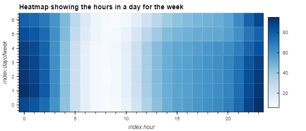
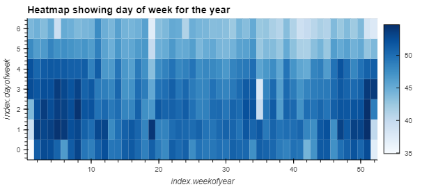
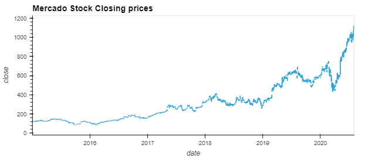
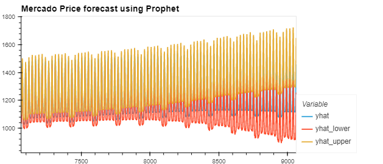
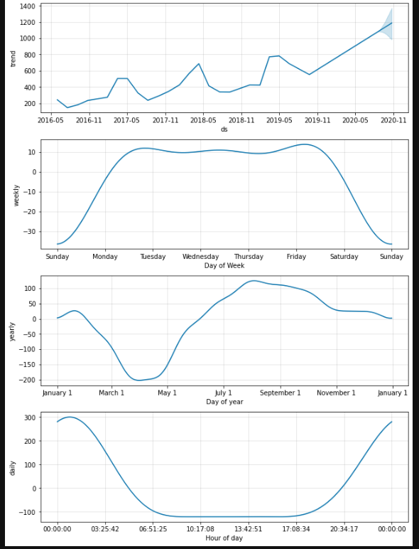
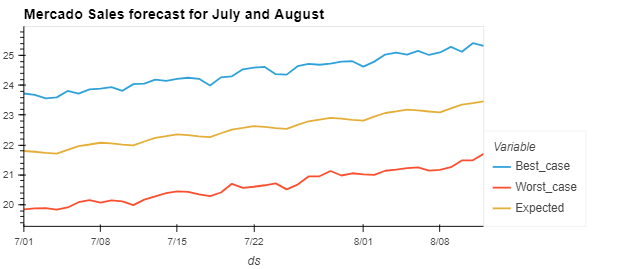

# Time-series-analysis
Challenge 11 for fintech bootcamp through UC Berkeley. Using prophet to analyze time-series data and google trends on MercadoLibre to see if there is any seasonal/weekly patterns, as well as forecasting future revenue based on sales data. The notebook `forecasting_net_prophet.ipynb` starts by analyzing google trend data to see if there is any seasonal pattern in the google search volume. Generating heatmap hvplots to visualize the data on an hourly/weekly schedule and over the whole year to see any seasonality patterns. After which it goes on to prepare the data for the prophet time series forecast on price and sales data. The results from this analysis can be seen below the instructions for getting setup locally.

Skip to 'Usage and Results' if you already have a `dev` environment or similar setup for running local git repositories.

---

## Packages and Version

First before installing any packages and getting setup make sure you are in a `dev` environment or an environment(env) you are comfortable downloading packages into. 
To get your `dev` environment setup do the following in your command line:

- Creating a dev environment for python 3.7 called 'dev' - if you do not already have an environment setup 
    - Get setup in your preferred CLI (Gitbash, terminal, etc)
    - `conda create -n dev python=3.7 anaconda`
    - Once you have created the environment, type the following to activate and deactivate.

Once you are setup with your `dev` or similar env the only packages you need to have are listed below:

- hvplot == 0.8.1 or higher
- prophet == 1.1.1 or higher
- up-to-date voila package (to visualize notebook in browser)

Simply do a `pip install package` replacing 'package' with the package name you are missing. 
Next make sure you clone the repo locally in the directory of your choice and follow below once ready.

---

## Usage and Results

Once you are setup with the `dev` env and have cloned the repo locally, navigate to the file within your preferred command line interface (CLI) and type `jupyter lab` to view the full notebook and be free to edit it yourself. Type `voila forecasting_net_prophet.ipynb` if you want to view it in a browser with all the background code removed and just view the results.

After getting the data analyzed there was a clear pattern that seemed to show itself with search traffic and times of day. Time of year was a little more unclear but there we some slight variations you will see on the graphs below. 

In the two above charts we can see two different things. The first one, hours in a day for the week' we see a clear trend with more search traffic in the early/later hours and in the middle 6-10 the volume fades away, and this trend stays consistent for each day of the week. The daily traffic, on a weekly schedule, showing the year (second chart) shows a more chaotic pattern, however we can see some more consistent darker blues in the early weeks, (0-10) and the later weeks (45+) showing stronger search volume around those time frames. 

Next, I started analyzing the stock price of MercadoLibre, below you will see the regular stock price, and then a prophet forecast for the next 2000 hourly datapoints. 

Above we have a couple charts so let’s take them one at a time. As mentioned, the first one is just the stock closing price for MercadoLibre. The second chart is our 2000 forecasted data points, showing the yhat, yhat_lower, and yhat_upper (basically your average predication price, and the lower/higher range). Lastly, we have 4 charts in one screenshot that breakdown the models predication and any time patterns it noticed with the dataset it was trained on. Analyzing the result, the price forecast doesn’t really mean much and gives us a wide range of the where the model thinks price can go. This will change drastically based on the data its trained on and what happens in the future if the model were to be trained again and try another predication. However, in the last photo with the 4 charts we do see what the model was able to learn which also seemed to follow our pattern in the google search trend data. The stock price tended to be more volatile in the early/late hours of the day(0-4am and 830-midnight). The model also noticed a yearly trend with the late summer months (July October) being the most positive times. As well as noticing that on weekends little to no volatility happened and mon-fri was where the stock seemed to move.

Lastly, I did some forecasting on the MercadoLibre sales given the data provided for Mercado's sales the prophet model was able to predict possible sales to expect in the following quarter, the results can be seen below.

This forecast makes a lot more sense and can easily digested quickly, showing the expected ranges for what the model thinks the sales will be as well as the higher and lower ranges based on the past data it was trained on. This can help give the finance team a better idea on how to plan budgets or what to expect sales to be to inform investors. 

---
## Contributors

[Robin Thorsen] (https://www.linkedin.com/in/robin-thorsen-079819120/) was the main developer/analyst working on this project. Starter code and resources provided by UC Berkeley.

Best reached via email - robinbthorsen@gmail.com

---

## License

Apache 2.0 public License applied, feel free to clone and fork and use and reach out if you have questions. 

